# 도소매 가격비교 플랫폼 - Mermaid 다이어그램

## 📋 목차

1. [ERD (데이터베이스 구조)](#1-erd-데이터베이스-구조)
2. [시스템 아키텍처](#2-시스템-아키텍처)
3. [사용자 플로우 - 도매점](#3-사용자-플로우---도매점)
4. [사용자 플로우 - 소매점](#4-사용자-플로우---소매점)
5. [AI 표준화 프로세스](#5-ai-표준화-프로세스)
6. [주문 처리 시퀀스](#6-주문-처리-시퀀스)
7. [가격 비교 프로세스](#7-가격-비교-프로세스)
8. [컴포넌트 구조](#8-컴포넌트-구조)

---

## 1. ERD (데이터베이스 구조)

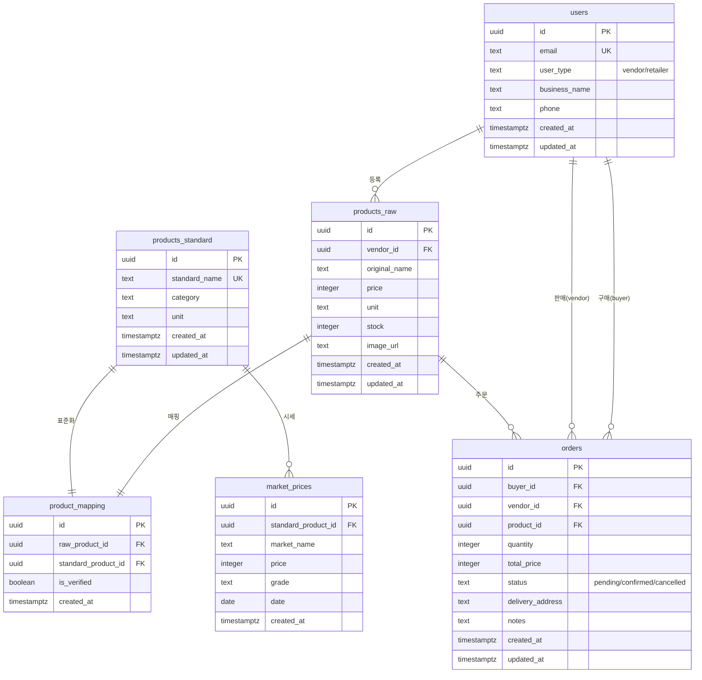

---

## 2. 시스템 아키텍처

```mermaid
graph TB
    subgraph "클라이언트"
        A[Next.js 15 App Router]
        A1[React Components]
        A2[Tailwind CSS]
        A3[shadcn/ui]
    end

    subgraph "인증"
        B[Clerk]
        B1[회원가입/로그인]
        B2[사용자 관리]
        B3[웹훅]
    end

    subgraph "백엔드 API"
        C[Next.js API Routes]
        C1[/api/products]
        C2[/api/orders]
        C3[/api/market-prices]
        C4[/api/webhooks/clerk]
    end

    subgraph "AI 서비스"
        D[Google Gemini API]
        D1[상품명 표준화]
        D2[Gemini 1.5 Flash]
    end

    subgraph "데이터베이스"
        E[Supabase PostgreSQL]
        E1[6개 테이블]
        E2[Storage 이미지]
    end

    subgraph "외부 API"
        F[공공데이터 API]
        F1[농수산식품유통공사]
        F2[실시간 경매 시세]
    end

    subgraph "배포"
        G[Vercel]
        G1[자동 배포]
        G2[프로덕션 환경]
    end

    A --> B
    A --> C
    B --> B3
    B3 --> C4
    C --> D
    C --> E
    C --> F
    C1 --> D1
    C3 --> F1
    G --> A

    style A fill:#10b981,stroke:#059669,color:#fff
    style D fill:#4285f4,stroke:#1967d2,color:#fff
    style E fill:#3ecf8e,stroke:#2da771,color:#fff
    style F fill:#f59e0b,stroke:#d97706,color:#fff
```

---

## 3. 사용자 플로우 - 도매점

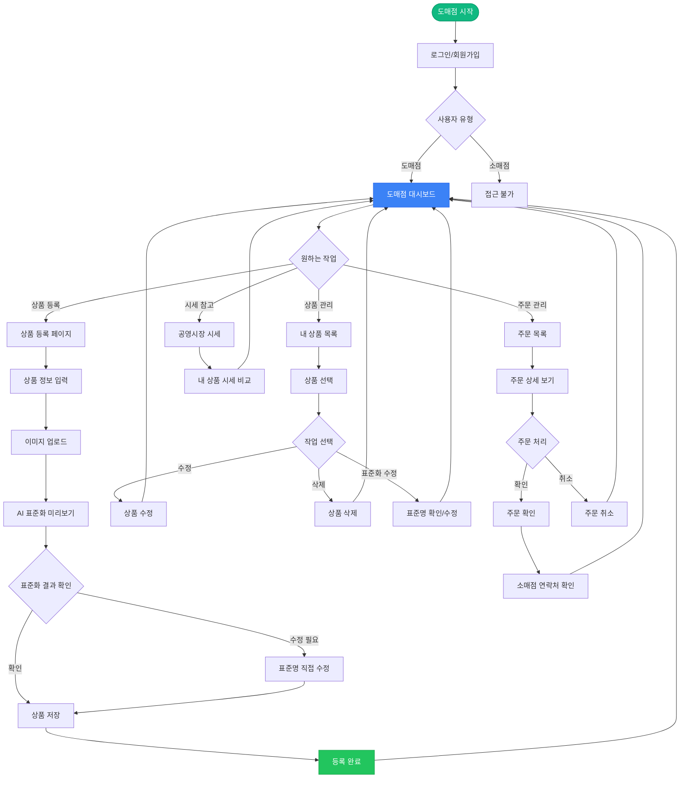

---

## 4. 사용자 플로우 - 소매점

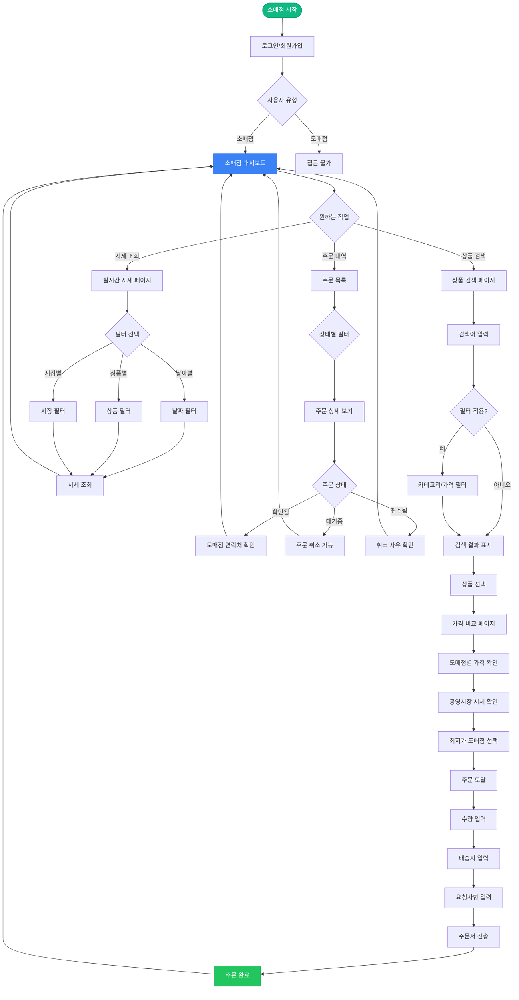

---

## 5. AI 표준화 프로세스

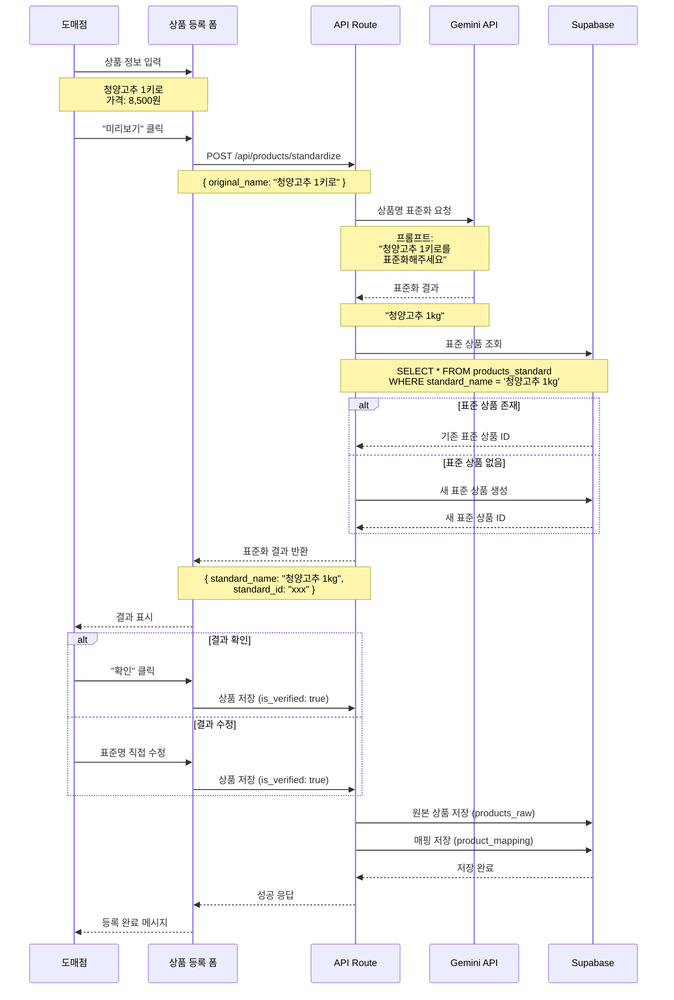

---

## 6. 주문 처리 시퀀스

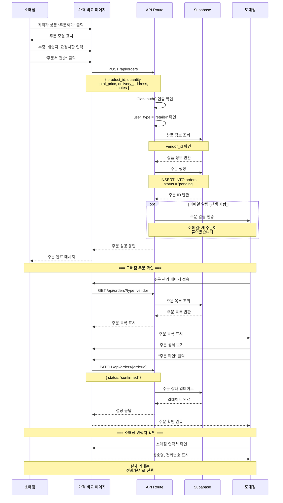

---

## 7. 가격 비교 프로세스

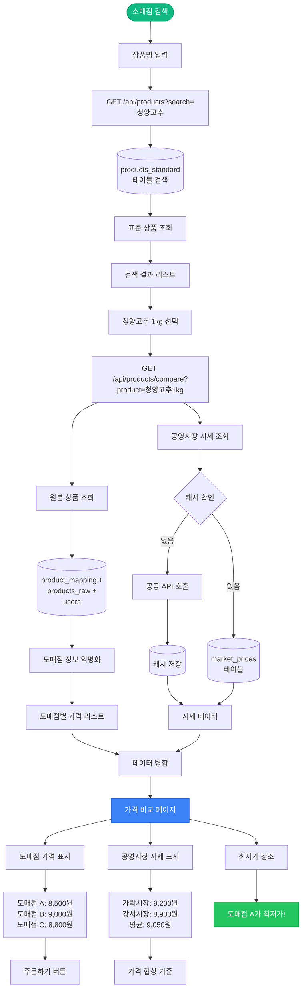

---

## 8. 컴포넌트 구조

```mermaid
graph TB
    subgraph "App Router"
        A[app/]
        A --> A1["(auth)/"]
        A --> A2["(main)/"]
        A --> A3["(vendor)/"]
        A --> A4["api/"]

        A1 --> A11["sign-in/"]
        A1 --> A12["sign-up/"]

        A2 --> A21["page.tsx (홈)"]
        A2 --> A22["products/"]
        A2 --> A23["market-prices/"]
        A2 --> A24["orders/"]

        A3 --> A31["vendor/products/"]
        A3 --> A32["vendor/orders/"]
        A3 --> A33["vendor/market-prices/"]

        A4 --> A41["products/"]
        A4 --> A42["orders/"]
        A4 --> A43["market-prices/"]
        A4 --> A44["webhooks/clerk/"]
    end

    subgraph "Components"
        B[components/]
        B --> B1["layout/"]
        B --> B2["products/"]
        B --> B3["orders/"]
        B --> B4["market-prices/"]
        B --> B5["ui/ (shadcn)"]

        B1 --> B11["Header.tsx"]
        B1 --> B12["Sidebar.tsx"]
        B1 --> B13["MobileNav.tsx"]
        B1 --> B14["SearchBar.tsx"]

        B2 --> B21["ProductCard.tsx"]
        B2 --> B22["ProductList.tsx"]
        B2 --> B23["ProductForm.tsx"]
        B2 --> B24["ProductFilters.tsx"]
        B2 --> B25["PriceCompareCard.tsx"]

        B3 --> B31["OrderCard.tsx"]
        B3 --> B32["OrderList.tsx"]
        B3 --> B33["OrderModal.tsx"]
        B3 --> B34["OrderStatusBadge.tsx"]

        B4 --> B41["MarketPriceCard.tsx"]
        B4 --> B42["MarketPriceList.tsx"]
        B4 --> B43["PriceChart.tsx"]

        B5 --> B51["button.tsx"]
        B5 --> B52["card.tsx"]
        B5 --> B53["dialog.tsx"]
        B5 --> B54["input.tsx"]
        B5 --> B55["skeleton.tsx"]
    end

    subgraph "Libraries"
        C[lib/]
        C --> C1["supabase.ts"]
        C --> C2["gemini.ts"]
        C --> C3["market-api.ts"]
        C --> C4["types.ts"]
    end

    A --> B
    A --> C
    B --> C

    style A fill:#10b981,stroke:#059669,color:#fff
    style B fill:#3b82f6,stroke:#2563eb,color:#fff
    style C fill:#8b5cf6,stroke:#7c3aed,color:#fff
```

---

## 9. 기술 스택 다이어그램

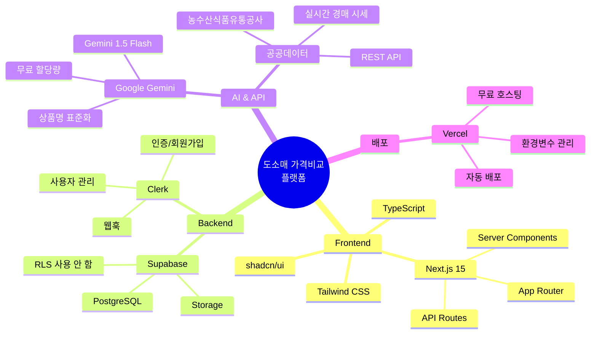

---

## 10. 데이터 흐름도 (전체 시스템)

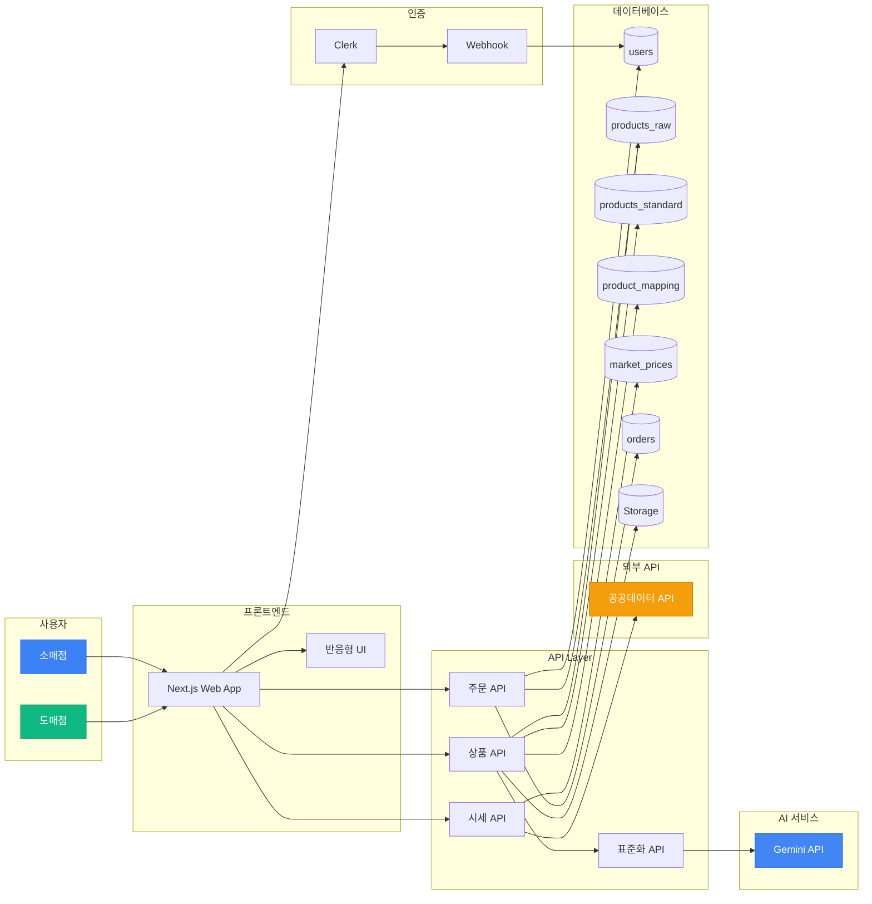

---

## 11. 주요 기능별 상태 다이어그램

### 11.1 상품 등록 상태

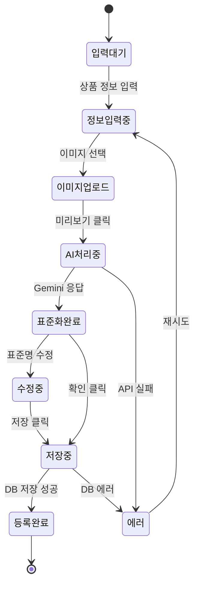

### 11.2 주문 상태

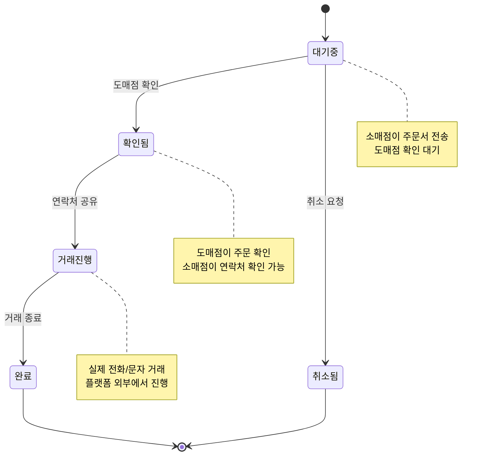

---

## 12. 반응형 레이아웃 구조

```mermaid
flowchart TD
    subgraph "Desktop (1024px+)"
        D1[Header: 로고, 검색, 프로필]
        D2[Sidebar 240px: 메뉴]
        D3[Main Content: 나머지 공간]
        D1 --- D2
        D2 --- D3
    end

    subgraph "Tablet (768px-1024px)"
        T1[Header: 로고, 검색, 프로필]
        T2[Sidebar 축소: 아이콘만]
        T3[Main Content: 넓어짐]
        T1 --- T2
        T2 --- T3
    end

    subgraph "Mobile (< 768px)"
        M1[Header: 로고, 검색, 프로필]
        M2[Main Content: 전체 너비]
        M3[Bottom Nav: 5개 아이콘]
        M1 --- M2
        M2 --- M3
    end

    style D1 fill:#10b981,stroke:#059669,color:#fff
    style T1 fill:#3b82f6,stroke:#2563eb,color:#fff
    style M1 fill:#8b5cf6,stroke:#7c3aed,color:#fff
```

---

## 13. 개발 일정 간트 차트

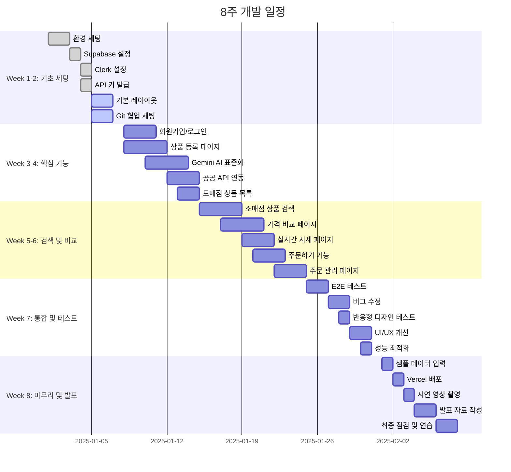

---

## 📝 사용 방법

### GitHub, Notion, Confluence 등에서 Mermaid 사용하기:

1. **GitHub README.md**

   ````markdown
   ```mermaid
   graph TD
       A[Start] --> B[End]
   ```
   ````

   ```

   ```

2. **Mermaid Live Editor**

   - https://mermaid.live
   - 위 코드를 복사하여 붙여넣기
   - 실시간으로 다이어그램 확인 가능

3. **VS Code Extension**

   - "Markdown Preview Mermaid Support" 설치
   - Markdown 미리보기에서 Mermaid 렌더링

4. **Notion**
   - 코드 블록에 언어를 "mermaid"로 설정
   - 자동으로 다이어그램 렌더링

---

## 📋 다이어그램 설명

| 번호 | 다이어그램명       | 용도                             |
| ---- | ------------------ | -------------------------------- |
| 1    | ERD                | 데이터베이스 테이블 관계 시각화  |
| 2    | 시스템 아키텍처    | 전체 기술 스택 및 연결 구조      |
| 3    | 도매점 플로우      | 도매점 사용자의 작업 흐름        |
| 4    | 소매점 플로우      | 소매점 사용자의 작업 흐름        |
| 5    | AI 표준화 프로세스 | Gemini API 상품명 표준화 상세    |
| 6    | 주문 처리 시퀀스   | 주문 생성부터 확인까지 전체 과정 |
| 7    | 가격 비교 프로세스 | 검색부터 가격 비교까지 프로세스  |
| 8    | 컴포넌트 구조      | Next.js 파일/폴더 구조           |
| 9    | 기술 스택          | 사용 기술 마인드맵               |
| 10   | 데이터 흐름도      | 전체 시스템 데이터 흐름          |
| 11   | 상태 다이어그램    | 주요 기능의 상태 전환            |
| 12   | 반응형 레이아웃    | 기기별 레이아웃 구조             |
| 13   | 개발 일정          | 8주 간트 차트                    |

---

**문서 버전:** 1.0  
**작성일:** 2025-11-10  
**기반:** PRD1_1_web.md, SQL1_1_web.sql
